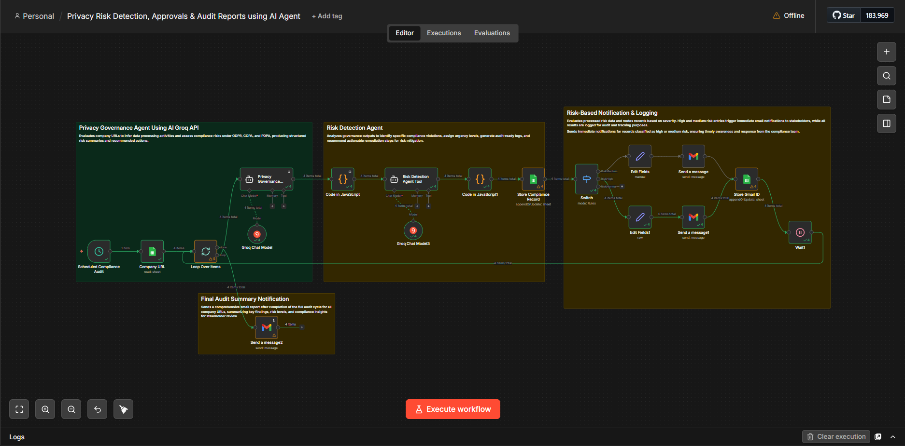

# Privacy Risk Detection, Approvals & Audit Workflow

This repository contains an n8n workflow for privacy risk detection, approvals, and audit reporting using an AI agent.

## Workflow Image

## Workflow Overview

The workflow is built around a privacy governance AI agent designed to evaluate URLs for compliance risks across multiple regulatory frameworks. It combines scheduled audit execution, AI-driven risk assessment, data processing, and automated reporting.

What this workflow does:

- Schedules regular privacy compliance audits using a `Scheduled Compliance Audit` trigger.
- Sends URL data through a `Privacy Governance Agent` powered by n8n LangChain agent nodes.
- Uses a second `Risk Detection Agent Tool` to analyze the governance assessment and generate detailed risk findings.
- Creates structured output for audit logs, recommended actions, and routing decisions.
- Sends email alerts to the compliance team with summary risk details using the Gmail node.
- Supports external AI model integration and OAuth2-based authentication, such as Groq API or similar AI service credentials.
- Processes and transforms risk assessment data to produce compliance reports and audit-ready summaries.

Key workflow elements include:

- `Scheduled Compliance Audit` trigger node to run regular audits.
- `Privacy Governance Agent` node that performs a privacy risk assessment using an AI prompt.
- `Risk Detection Agent Tool` node that evaluates the assessment output and structures risks for audit reporting.
- `Send a message` node that sends alerts via email when risks are detected.

## How to Use

1. Open n8n.
2. Import the workflow from `Workflow/Privacy Risk Detection, Approvals & Audit Reports using AI Agent.json`.
3. Review or update credentials as needed.
4. Activate the workflow.

## Workflow Diagram

## Notes

- The workflow is intended for deployment in a privacy and compliance review process.
- The AI agent prompt focuses on GDPR, CCPA, and PDPA risk assessment.
- Email settings are configured in the workflow and may require credential updates before use.

## License

See the `LICENSE` file for license details.
